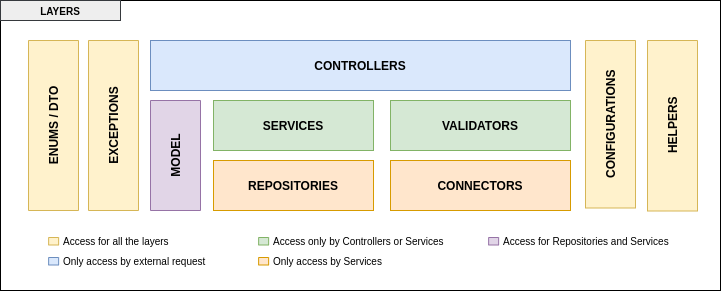

# Where is the logic of my application

[](https://opensource.org/licenses/MIT)

The project contain all the code of the talk.


## Table of contents

The following are the most important topics in this file:
- [Requirements](#Requirements)
- [Check requirements](#check-requirements)
- [Architecture](#architecture)

# Requirements

To use these tools you need to have in your machine the following things:
- [Java](https://www.oracle.com/ar/java/technologies/downloads/)
- [Maven](https://maven.apache.org/)
- [Git](https://git-scm.com/)
- [Docker](https://www.docker.com/)

If you don't have some of these tools in your machine installed, please follow the instructions in the official documentation of each tool.

# Check requirements

If you have installed on your machine some of these tools previously or you installed all the tools now, please check if everything works fine.
- Check which version of Java you have using the following command:
   ````
   % java -version
  openjdk 21.0.2 2024-01-16
  OpenJDK Runtime Environment GraalVM CE 21.0.2+13.1 (build 21.0.2+13-jvmci-23.1-b30)
  OpenJDK 64-Bit Server VM GraalVM CE 21.0.2+13.1 (build 21.0.2+13-jvmci-23.1-b30, mixed mode, sharing)
   ````
- Check whether your Maven version is 3.8.3 or up. You can see which version of Maven you have using the following command:
   ````
   % mvn --version
   Apache Maven 3.8.3
   Maven home: /usr/share/maven
   ````
- Check whether the version of Docker in your machine is 18.09.0 or higher. You can check the version of Docker using the following command:

   ````
   % docker --version
   Docker version 18.09.0, build 369ce74a3c
   ````

# Architecture

All the microservices are split in different layers which only have access to others layers. The following figure show you the common structure in all the microservices:



Now, a little about what contain each layer:

| Layer         | Description                                                                                                             | Packages                                              |
|---------------|-------------------------------------------------------------------------------------------------------------------------|-------------------------------------------------------|
| Controllers   | Contain all the endpoints and the documentation about the microservices                                                 | *.controller and *.controller.documentation           |
| Services      | Contain all the definition of the services and the implementation                                                       | *.service and *.service.impl                          |
| Validators    | Contain all the logic to validate a Request of a DTO                                                                    | *.validator                                           |
| Repositories  | This layer contain the definition using interfaces and in some cases contain the specification to do a particular query | *.repository, *.repository.impl, and *.specification  |
| Connectors    | Inside this layer there are all the configurations and the endpoints to communicate with external services.             | *.connector and *.connector.configuration             |
| Helpers       | All the classes that help in different things in the entire microservices (e.g calculate the duration of a flight)      | *.helper                                              |
| Configuration | All the logic to configure different aspects of the microservices (e.g format of the response, ports)                   | *.configuration                                       |
| Exceptions    | Contain all the exceptions that each microservice can throw during the execution of a request                           | *.exception                                           |
| Model         | This particular layer contain all the entities which access to the databases                                            | *.model                                               |
| Enums/DTO     | In this layer you can find the classes and the enum that are using across the different layers                          | *.enums and *.dto                                     |
